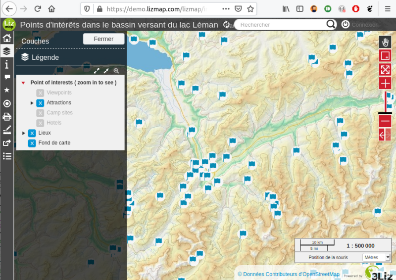

# [][3liz]Lizmap Web Application 3.10.0-pre

Lizmap web application, by 3LIZ.

    begin       : 2011-11-01
    copyright   : (C) 2011-2025 by 3liz
    authors     : René-Luc D'Hont and Michaël Douchin
    email       : info@3liz.com
    website     : http://www.3liz.com

Lizmap Web Application generates dynamically a web map application (php/html/css/js) with the help of QGIS Server ([QGIS as OGC Data Server]).
You can visit [some examples projects on the demo](https://demo.lizmap.com/lizmap/).
You can configure one web map per QGIS project with the QGIS Lizmap plugin. From this plugin, you can enable some
tools such as attribute table, dataviz, printing…
The Lizmap web application must be installed on the server.

The Original Code is [3Liz](https://3liz.com) code.

You can find help and news by subscribing to the mailing list: https://lists.osgeo.org/mailman/listinfo/lizmap.

## Versions

We recommend you reading the [versions](https://github.com/3liz/lizmap-web-client/wiki/Versions) page about QGIS Server,
web-browsers etc.

## Main Features

* Map options
  * Printing
  * Measuring tools
  * Scales
* Layer editions
* Attribute table
* Filter data by user
* Filter form
* Tooltips
* Dataviz
* Locate by layer
* Layer tree
  * Enable and disable layers and groups
  * Change layer opacity
  * Layer Popup

## Documentation and customization

https://docs.lizmap.com/

Documentation source: https://github.com/3liz/lizmap-documentation/

You can add your custom Javascript, check your [Javascript library](https://github.com/3liz/lizmap-javascript-scripts/)

Some modules can be added to Lizmap:
* Map Builder https://github.com/3liz/lizmap-mapbuilder-module
* Naturaliz https://github.com/3liz/lizmap-naturaliz-module
* French Cadastre https://github.com/3liz/lizmap-cadastre-module
* French Adresse https://github.com/3liz/lizmap-adresse-module

## Internationalization

Transifex: https://www.transifex.com/3liz-1/lizmap-locales/

Locales source: https://github.com/3liz/lizmap-locales/

## Authors

The Initial Developer of the Original Code are René-Luc D'Hont and Michael Douchin.
Portions created by the Initial Developer are Copyright (C) 2011 the Initial Developer.
All Rights Reserved.

## Contributors

* Paolo Cavallini
* Salvatore Larosa
* Giovanni Manghi
* Laurent Jouanneau
* José Macau
* David Marteau
* Vitor Jorge
* Nicolas Boisteault
* Arnaud Deleurme
* Víctor Herreros
* Aitor Gil
* Felix Kuehne
* João Gaspar
* Sławomir Bienias
* Petr Tsymbarovich
* Alessandro Fanna
* Marta Puppo
* Pietro Rossin
* Kari Salovaara
* Xan Vieiro
* Rasmus Johansson
* Jankó J A

## License

Version: MPL 2.0/GPL 2.0/LGPL 2.1

The contents of this file are subject to the Mozilla Public License Version 2.0 (the "License"); you may not use this
file except in compliance with the License. You may obtain a copy of the License at http://www.mozilla.org/MPL/

Alternatively, the contents of this file may be used under the terms of either of the GNU General Public License Version
2 or later (the "GPL"), or the GNU Lesser General Public License Version 2.1 or later (the "LGPL"), in which case the
provisions of the GPL or the LGPL are applicable instead of those above. If you wish to allow use of your version of this
file only under the terms of either the GPL or the LGPL, and not to allow others to use your version of this file under
the terms of the MPL, indicate your decision by deleting the provisions above and replace them with the notice and other
provisions required by the GPL or the LGPL. If you do not delete the provisions above, a recipient may use your version
of this file under the terms of any one of the MPL, the GPL or the LGPL.

Software distributed under the License is distributed on an "AS IS" basis, WITHOUT WARRANTY OF ANY KIND, either express
or implied. See the License for the specific language governing rights and limitations under the License.

  [QGIS as OGC Data Server]: https://docs.qgis.org/testing/en/docs/server_manual/index.html
  [3Liz]:https://www.3liz.com
