# Lizmap Web Client 3.10

## New features

### Geolocation

The geolocation option comes with two new features: displaying an **arrow** showing the direction of travel ([#6167](https://github.com/3liz/lizmap-web-client/pull/6167)) and **map rotation** while tracking the position ([#6834](https://github.com/3liz/lizmap-web-client/pull/6834)).

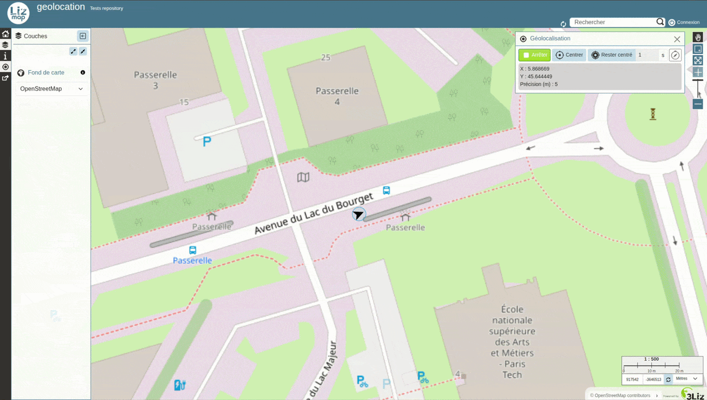

*Funded by Terre de Provence Agglomération - Developed by [René-Luc D'Hont](https://github.com/rldhont) & [Nicolas Boisteault](https://github.com/nboisteault)*

### Panoramax

New **Panoramax** viewer integrated into the map, allowing you to display the geolocated photos of a Panoramax layer directly in Lizmap ([#6904](https://github.com/3liz/lizmap-web-client/pull/6904)).

*Funded by Terre de Provence Agglomération - Developed by [Nicolas Boisteault](https://github.com/nboisteault)*

### Portfolio

New feature to run several layout templates at once ([#6634](https://github.com/3liz/lizmap-web-client/pull/6634)).

*Funded by the Municipality of Mirandela - Developed by [René-Luc D'Hont](https://github.com/rldhont)*

### DXF export

Added a **DXF export** tool, configurable via the plugin ([#6247](https://github.com/3liz/lizmap-web-client/pull/6247)).

*Developed by [meyerlor](https://github.com/meyerlor)*

## Improvements

### WMS layer

Improvements to the **Load layers as a single WMS image** mode: layers can now be excluded via the plugin ([#685](https://github.com/3liz/lizmap-plugin/pull/685)), layer opacity is better handled ([#6628](https://github.com/3liz/lizmap-web-client/pull/6628)), and base layers can be excluded ([#6351](https://github.com/3liz/lizmap-web-client/pull/6351)).

*Developed by [meyerlor](https://github.com/meyerlor)*

### Search

Search suggestions are more numerous, better ranked and more readable ([#6733](https://github.com/3liz/lizmap-web-client/pull/6733)). They appear directly while typing ([#6754](https://github.com/3liz/lizmap-web-client/pull/6754)).

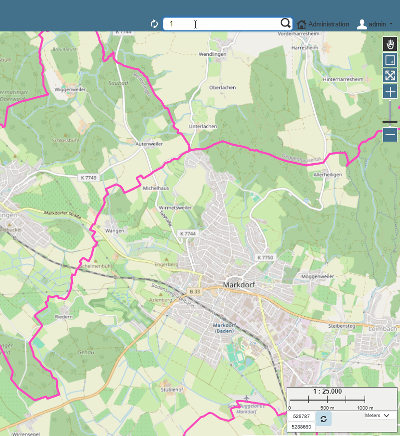

*Developed by [meyerlor](https://github.com/meyerlor)*

### Tooltip

The QGIS symbology can now be displayed in tooltips: for example, icons for a Point layer. On hover, the icon is enlarged for better visual feedback ([#5768](https://github.com/3liz/lizmap-web-client/pull/5768))

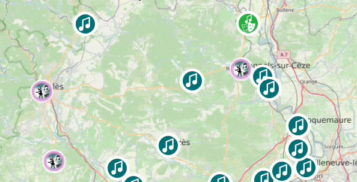

*Funded by the Conseil départemental du Gard - Developed by [Nicolas Boisteault](https://github.com/nboisteault)*

### Popup

* For popups following the drag-and-drop form design, the compact tables of child layers are now correctly placed in the chosen group or tab ([#6821](https://github.com/3liz/lizmap-web-client/pull/6821))

  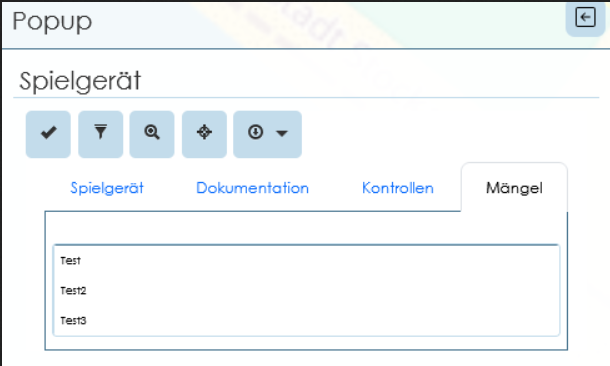

  *Developed by [meyerlor](https://github.com/meyerlor)*

* New mode to **group all popups by layer**, in a tabular view, with the ability to move from one popup to the next. This mode is configurable via the plugin. ([#6716](https://github.com/3liz/lizmap-web-client/pull/6716))

  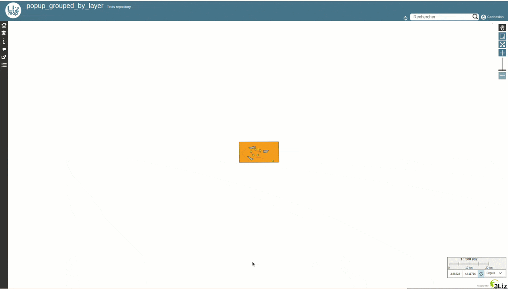

  *Funded by Etra - Developed by [Riccardo Beltrami](https://github.com/mind84)*

### Permalink

Permalinks now use a very short code and are stored permanently in a Lizmap system table. Layer symbology is also taken into account in the permalink ([#6886](https://github.com/3liz/lizmap-web-client/pull/6886)).
The list of permalinks is visible in the administration interface ([#6765](https://github.com/3liz/lizmap-web-client/pull/6765)).

*Funded by Etra - Developed by [Riccardo Beltrami](https://github.com/mind84)*

### Attribute table

* **Server-side pagination**, making it possible to display the attribute table
  for large volumes of data ([#5562](https://github.com/3liz/lizmap-web-client/pull/5562))

* Added a **query tool** to create a filter on several fields,
  for example to find all features whose category is A or B and whose
  creation date is later than January 1st, 2026 ([#5562](https://github.com/3liz/lizmap-web-client/pull/5562)).
  This tool also allows creating **nested sub-conditions** via external JavaScript
  (e.g. (A OR B) AND C) ([#6662](https://github.com/3liz/lizmap-web-client/pull/6662))

  

* This query tool respects **value list** and
  **value relation** configurations ([#6572](https://github.com/3liz/lizmap-web-client/pull/6572))

* Ability to **zoom to selected features**
  ([#6609](https://github.com/3liz/lizmap-web-client/pull/6609),
  improved by [#6778](https://github.com/3liz/lizmap-web-client/pull/6778))

* Ability to **select all filtered features**, including those that are not
  displayed on the current page ([#6632](https://github.com/3liz/lizmap-web-client/pull/6632))

*Funded by digi-studio, Etra & Faunalia - Developed by [Nicolas Boisteault](https://github.com/nboisteault), [René-Luc D'Hont](https://github.com/rldhont) & [Riccardo Beltrami](https://github.com/mind84)*

### Editing

* Support for **default value expressions** on all fields:
  values are computed on creation and on update (respecting the
  QGIS option "Apply default value on update").
  Values are recomputed when the geometry or one of the fields used
  in the expression changes.
  E.g.: `"firstname" || ' ' || "lastname"` or `area(@geometry)`
  ([#6818](https://github.com/3liz/lizmap-web-client/pull/6818))

  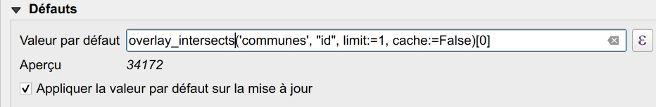

  *Developed by [meyerlor](https://github.com/meyerlor)*

* New option to **automatically enable snapping** when editing
  ([#6603](https://github.com/3liz/lizmap-web-client/pull/6603))
  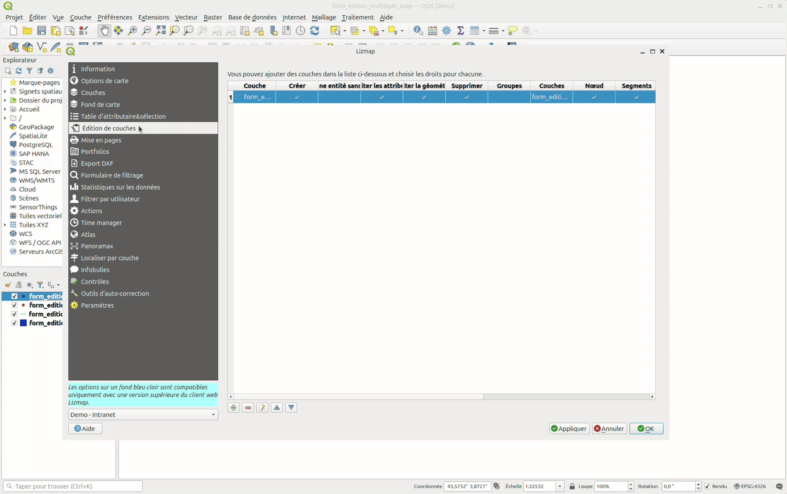

  *Developed by [meyerlor](https://github.com/meyerlor)*

* Right-click allows you to **copy the geometry** of a visible feature and reuse it for the feature being created. ([#6405](https://github.com/3liz/lizmap-web-client/pull/6405),
  copy/paste buttons merged in [#6613](https://github.com/3liz/lizmap-web-client/pull/6613))

  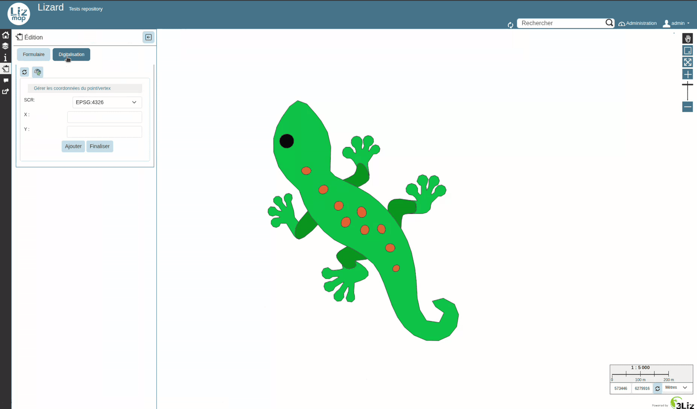

  *Developed by [meyerlor](https://github.com/meyerlor)*

* The **background color** defined in QGIS for form tabs
  is now used in the Lizmap form
  ([#6342](https://github.com/3liz/lizmap-web-client/pull/6342))

  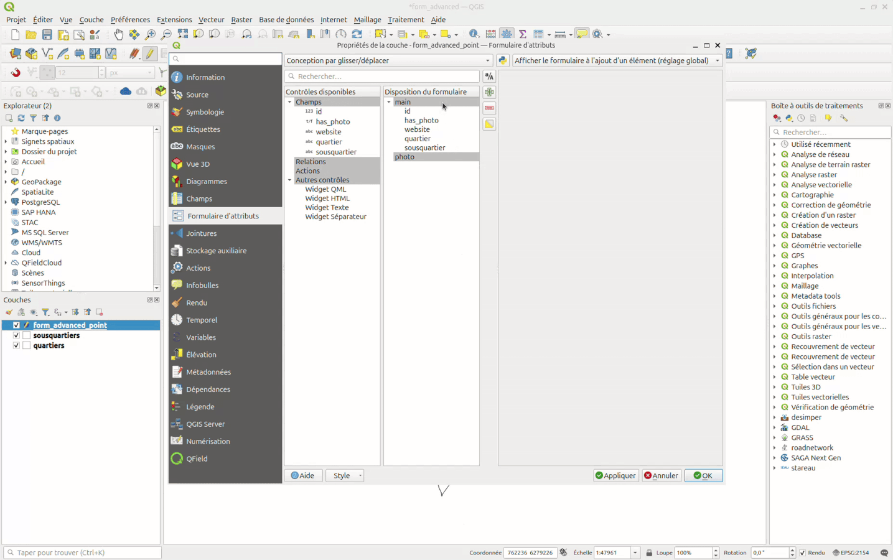

  *Funded by CC Parthenay-Gâtine - Developed by [Raphaël Martin](https://github.com/nworr)*

* For **attachments and images**, file names now follow the default value: the original name is replaced by the **result of the expression** ([#6602](https://github.com/3liz/lizmap-web-client/pull/6602)).

  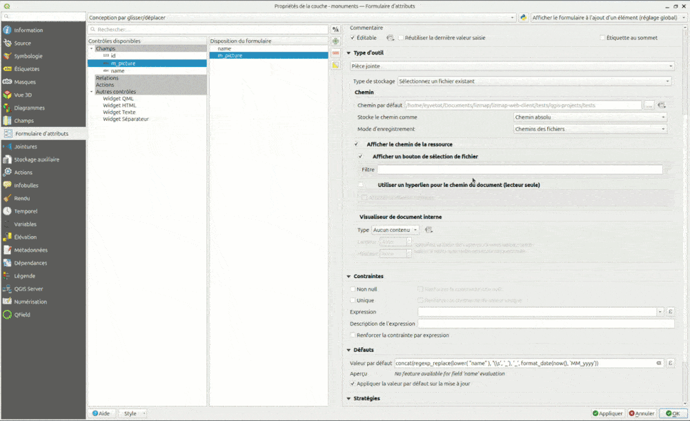

  *Developed by [meyerlor](https://github.com/meyerlor)*

* Support for **many-to-many relations** in the form,
  relying on the cardinality defined on `attributeEditorRelation` in QGIS
  ([#6806](https://github.com/3liz/lizmap-web-client/pull/6806))

  *Funded by Etra - Developed by [Riccardo Beltrami](https://github.com/mind84)*

### Legend

**Double-clicking** a layer's checkbox checks or unchecks all its symbology classes ([#6640](https://github.com/3liz/lizmap-web-client/pull/6640)).

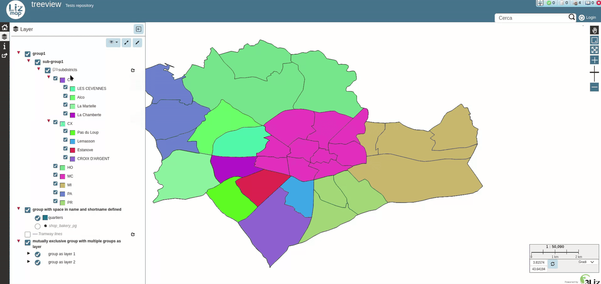

*Funded by Etra - Developed by [Riccardo Beltrami](https://github.com/mind84)*

### Print

* The **print scale** can be chosen independently of the display scales:
  users can print at a custom scale.
  ([#6653](https://github.com/3liz/lizmap-web-client/pull/6653))

  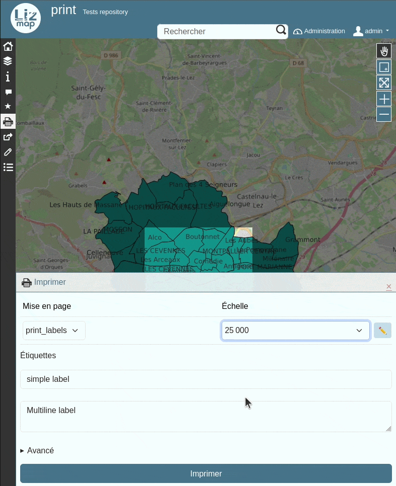

  *Funded by CC Bièvre Est - Developed by [Nicolas Boisteault](https://github.com/nboisteault)*

* The **exported PDF file name** for a single atlas feature now respects the configuration
  (using QGIS expressions) ([#6224](https://github.com/3liz/lizmap-web-client/pull/6224))

  *Developed by [meyerlor](https://github.com/meyerlor)*

* Ability to export a PDF **with several atlas features** at once
  by selecting features from the same layer. ([#6224](https://github.com/3liz/lizmap-web-client/pull/6224))

  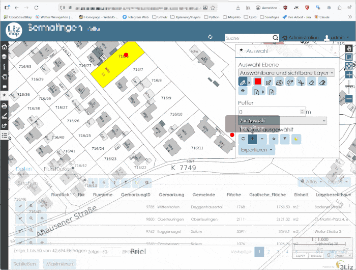

  *Developed by [meyerlor](https://github.com/meyerlor)*

### Selection

The **rectangle selection tool** is now automatically activated when the selection panel is displayed ([#6614](https://github.com/3liz/lizmap-web-client/pull/6614))

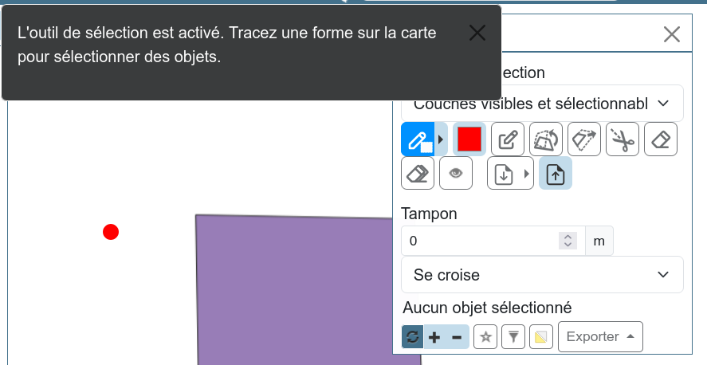

*Developed by [meyerlor](https://github.com/meyerlor)*

## Developers

### Actions

Ability to send **dynamic parameters from JavaScript** when triggering an action ([#6917](https://github.com/3liz/lizmap-web-client/pull/6917))

*Funded by 3Liz - Developed by [Eliott Yvetot](https://github.com/Elioooooott)*

### JavaScript

Reprojection: use of the **proj4rs** library, a proj4js equivalent written in **Rust**: https://github.com/3liz/proj4rs ([#5799](https://github.com/3liz/lizmap-web-client/pull/5799))

*Funded by 3Liz - Developed by [René-Luc D'Hont](https://github.com/rldhont)*

### Interface

Migration to **Bootstrap 5** ([#4455](https://github.com/3liz/lizmap-web-client/pull/4455), completed by [#6924](https://github.com/3liz/lizmap-web-client/pull/6924) and many
  fixes throughout the 3.10 cycle)

*Funded by 3Liz - Developed by [Nicolas Boisteault](https://github.com/nboisteault)*

## Breaking Changes

Following a change in the tile cache storage format, a cache pre-generated with a version prior to 3.10 is no longer used after the upgrade. The cache must be seeded again (the old orphaned cache can be deleted) ([#7183](https://github.com/3liz/lizmap-web-client/issues/7183)).
